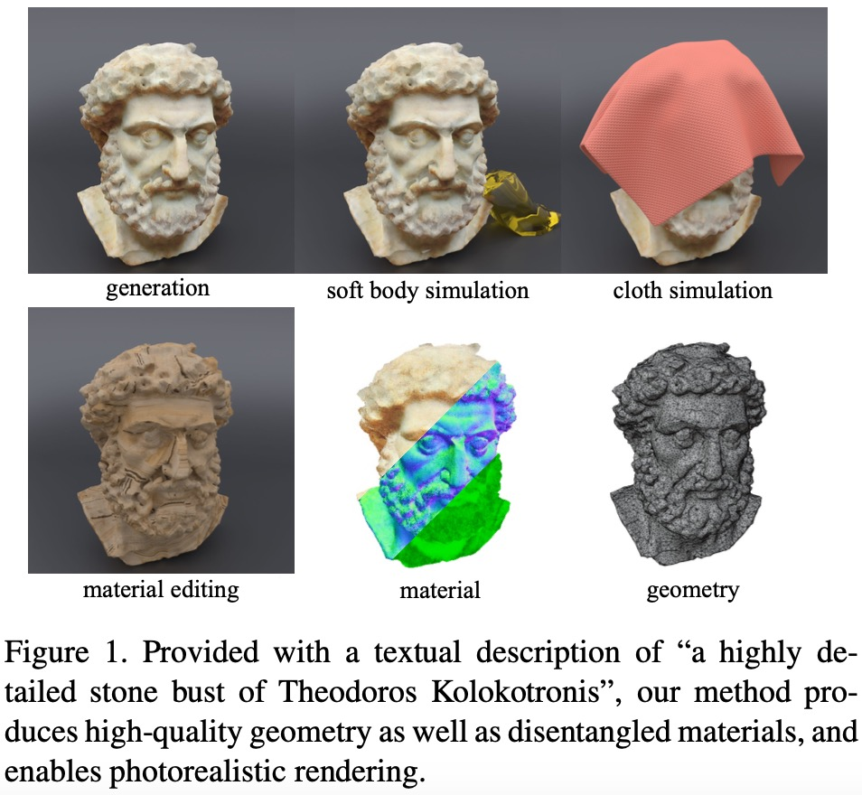
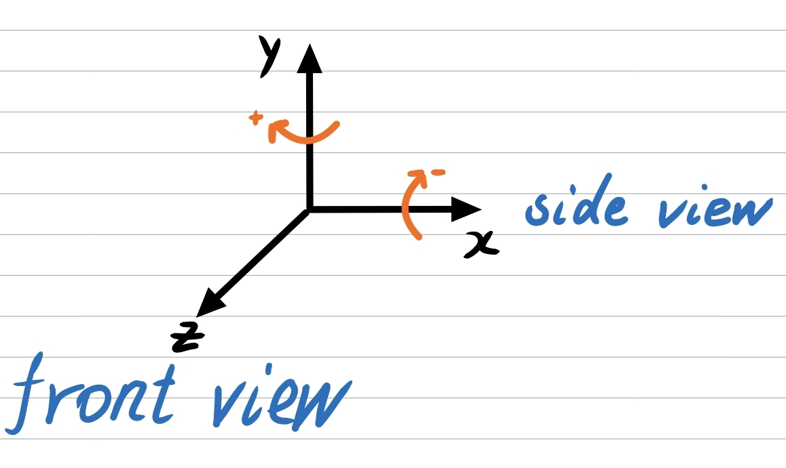

 # <p align="center"> <font color=#008000>Fantasia3D</font>: Disentangling Geometry and Appearance for High-quality Text-to-3D Content Creation </p>

 #####  <p align="center"> [Rui Chen*](https://aruichen.github.io/), [Yongwei Chen*](https://cyw-3d.github.io/), [Ningxin Jiao](https://ningxinj.github.io/), [Kui Jia](http://kuijia.site/)</p>
 ##### <p align="center"> ICCV2023
 ##### <p align="center"> *equal contribution
 
#### <p align="center">[Paper](https://fantasia3d.github.io/assets/Fantasia3D.pdf) | [ArXiv](http://arxiv.org/abs/2303.13873) | [Project Page](https://fantasia3d.github.io/) | [Supp_material](https://fantasia3d.github.io/assets/supp_materials.pdf) | [Video](https://www.youtube.com/watch?v=Xbzl4HzFiNo)</p>

<p align="center">
  
</p>

https://user-images.githubusercontent.com/128572637/acd52959-3fcf-4825-81b1-3b9efa2fb6cc

# Update log
**Please pull the latest code to improve performance!!**
- (2023.08.11)
  - Fix the bug about the unsmooth geometry in some cases.
- (2023.08.06)
  - Add a tip to improve the realism of appearance.
- (2023.08.05)
  - Fix the bug about the same seed between different gpus, which may not accelerate convergence. 
  - Add a part for directly performing UV padding in the code, so there is no need for additional operations in the blender.
- (2023.07.26)
  - Fix the bug about using the tangent space normal. 

# FAQs

***Q1***: *About the use of normal and mask images as the input of stable diffusion model and analysis*

Answer: Our initial hypothesis is that normal and mask images, representing local and silhouette information of shapes respectively, can benefit geometry learning. Additionally, we observed that the value range of the normal map is normalized to (-1, 1), which aligns with the data range required for latent space diffusion. Our empirical studies validate this hypothesis. Further support for our hypothesis comes from the presence of normal images in the LAION-5B dataset used for training Stable Diffusion (see [Website](https://rom1504.github.io/clip-retrieval/?back=https%3A%2F%2Fknn.laion.ai&index=laion5B-H-14&useMclip=false&query=normal+map) for retrieval of normal data in LAION-5B). Therefore, the normal data is not considered an out-of-distribution (OOD) input for stable diffusion. To handle rough and coarse geometry in the early stage of learning, we directly utilize concatenated 64 $\times$ 64 $\times$ 4 (normal, mask) images as the latent code, inspired by Latent-NeRF, to achieve better convergence. However, using the normal map without VAE encoding in the world coordinate system may lead to inconsistencies with the data distribution of the latent space trained by VAE. This mismatch can cause the generated geometry to deviate from the text description in some cases. To address this issue, we employ a data augmentation technique by randomly rotating the normal map rendered from the current view. This approach brings the distribution of the normal map closer to the distribution of latent space data. We experimentally observe that it improves the alignment between the generated geometry and the text description. As the learning progresses, it becomes essential to render the 512 $\times$ 512 $\times$ 3 high-resolution normal image for capturing finer geometry details, and we choose to use normal image only in the later stage. This strategy strikes an accuracy-efficiency balance throughout the geometry optimization process.

***Q2***: *Hypothesis-verification analysis of the disentangled representation*

Answer: Previous methods (e.g., DreamFusion and Magic3D) couple the geometry and appearance generation together, following NeRF. Our adoption of the disentangled representation is mainly motivated by the difference of problem nature for generating surface geometry and appearance. In fact, when dealing with finer recovery of surface geometry from multi-view images, methods (e.g.,  VolSDF, nvdiffrec, etc) that explicitly take the surface modeling into account triumph; our disentangled representation enjoys the benefit similar to these methods. The disentangled representation also enables us to include the BRDF material representation in the appearance modeling, achieving better photo-realistic rendering by the BRDF physical prior.

***Q3***: *Can Fantasia3D directly fine-tune the mesh given by the user?*

Answer: Yes, it can. Fantasia3D can receive any mesh given by the user and fine-tune it using our method of user-guided generation. It can also naturally interface with the 3D generative method like shape-e and point-e. In a word, Fantasia3D can generate highly detailed and high-fidelity 3D content based on either the low-quality mesh given by the users or the ellipsoid.

# What do you want?

Considering that parameter tuning may require some experience, what kind of object do you want me to generate? Please speak freely in the issue area. I will take some time to implement some requirements and update the corresponding configuration files for your convenience in reproducing.

# Contribute to Fantasia3D

Firstly, upload the videos converted from gifs using the [Website](https://convertio.co/zh/gif-mp4/), including the geometry or appearance, to the [Gallery](https://github.com/Gorilla-Lab-SCUT/Fantasia3D/issues/19). Write down the text to generate the object, the performance, the resolution of the tetrahedron for geometry modeling, and the strategy adopted for appearance modeling. 

Subsequently, upload the configuration file under the directory of `configs`. If you will upload the file about the user-guided generation, the guided mesh should also be uploaded under the directory of `data`. The naming rule of the file is as follows.

For the file of zero-shot geometry modeling:
```bash
{The key word of the text}_geometry_zero_shot_{the number of gpu}_gpu.json
```
For the file of user-guided geometry modeling:
```bash
{The key word of the text}_geometry_user_guided_{the number of gpu}_gpu.json
```
For the file of appearance modeling:
```bash
{The key word of the text}_appearance_strategy{the strategy adopted}_{the number of gpu}_gpu.json.
 ```
# Install

- System requirement: Ubuntu20.04
- Tested GPUs: RTX3090, RTX4090, A100, V100

We provide two choices to install the environment.
- (Option 1) Use the file  requirements.txt to install all packages one by one. It may fail since the complexity of some packages.

  ```bash
  pip install torch==1.12.1+cu113 torchvision==0.13.1+cu113 -f https://download.pytorch.org/whl/torch_stable.html
  pip install -r requirements.txt
  ```
- (Option 2) Use the docker image to deploy the environment in the Ubuntu system quickly. 

  ```bash
  docker pull registry.cn-guangzhou.aliyuncs.com/baopin/fantasia3d:1.0
  ```
  Due to the Internet Network Delay, the package of xformers was not installed in this docker image. Install it by hand after you create a docker container using this docker image. 

  ```bash
  pip install git+https://github.com/facebookresearch/xformers.git@main#egg=xformers
  ```

After the successful deployment of the environment, clone the repository of Fantasia3D and get started.
```bash
git clone https://github.com/Gorilla-Lab-SCUT/Fantasia3D.git
cd Fantasia3D
```

# Start
All the results in the paper were generated using 8 3090 GPUs. We cannot guarantee that fewer than 8 GPUs can achieve the same effect.
- zero-shot generation
```bash
# Multi-GPU training
...
# Geometry modeling using 8 GPU 
python3 -m torch.distributed.launch --nproc_per_node=8 train.py --config configs/car_geometry.json
# Geometry modeling using 4 GPU
python3 -m torch.distributed.launch --nproc_per_node=4 train.py --config configs/car_geometry.json
# Appearance modeling using 8 GPU
python3 -m torch.distributed.launch --nproc_per_node=8 train.py --config configs/car_appearance_strategy0.json
# Appearance modeling using 4 GPU
python3 -m torch.distributed.launch --nproc_per_node=4 train.py --config configs/car_appearance_strategy0.json
...
# Single GPU training (Only test on the pineapple). 
# Geometry modeling. It takes about 15 minutes on 3090 GPU.
python3  train.py --config configs/pineapple_geometry_single_gpu.json
# Appearance modeling. It takes about 15 minutes on 3090 GPU.
python3  train.py --config configs/pineapple_appearance_strategy0_single_gpu.json
```

- user-guided generation

```bash
# Multi-GPU training
...
# Geometry modeling using 8 GPU
python3 -m torch.distributed.launch --nproc_per_node=8 train.py --config configs/Gundam_geometry.json
# Geometry modeling using 4 GPU
python3 -m torch.distributed.launch --nproc_per_node=4 train.py --config configs/Gundam_geometry.json
# Appearance modeling using 8 GPU
python3 -m torch.distributed.launch --nproc_per_node=8 train.py --config configs/Gundam_appearance.json
# Appearance modeling using 4 GPU
python3 -m torch.distributed.launch --nproc_per_node=4 train.py --config configs/Gundam_appearance.json
...
# Single GPU training
# Geometry modeling (untested)
python3  train.py --config configs/Gundam_geometry.json 
# Appearance modeling (untested)
python3  train.py --config configs/Gundam_appearance.json
```

# Tips
- ***(both) Train longer.*** Training longer may help with the finer details. You can train longer by setting the parameter "iter".

- ***(both) Larger batch size.*** A larger batch size can help with the faster convergence. Corresponding parameter is "batch".

- ***(both) Try different seeds.*** Different seeds can bring diverse results.

- ***(both) Scale the object.*** Increasing the proportion of initialized objects in the FOV = 45 screens can reinforce the quality of both the geometry and appearance modeling. For geometry modeling, it can attain more local geometric details. For appearance modeling, this method can reduce the probability of saturated or strange colors appearing, as it reduces the proportion of background colors in the image. We found that if the proportion of background color is too high, it can easily lead to saturation and strange colors.

- ***(geometry modeling) Provide a proportional prior of the target shape.***  You can scale the default sphere with a radius of 1 to an ellipsoid. For instance, make the radius of the ellipsoid on the z-axis larger if you want to generate "A car made out of cheese".

  ```bash
  "mode": "geometry_modeling",
  "sdf_init_shape": "ellipsoid",
  "sdf_init_shape_scale": [0.56, 0.56, 0.84]
  ```

  There is a situation where ellipsoid cannot provide a proportional prior, such as the generation of an animal. In this case, using ellipsoid initialization can easily cause the generated animal to have multiple feet.
  Run the following command to examine:

  ```bash
  python3 -m torch.distributed.launch --nproc_per_node=8 train.py --config configs/elephant_geometry_fail_multi_face.json 
  ```
  Instead, you can use the sketch shape of a quadruped as a proportional prior to generating any animal shape you want. 
  ```bash
  python3 -m torch.distributed.launch --nproc_per_node=8 train.py --config configs/elephant_geometry_succeed.json
  ```
  In other situations, such as the generation of the human-like body, a human sketch shape can be used.
  ```bash
  python3 -m torch.distributed.launch --nproc_per_node=8 train.py --config configs/Gundam_geometry.json
    ```

- ***(geometry modeling) Increae the number of iterations in the early phase.***  The early phase is very crucial to create a coarse and correct shape. The late phase just focuses on attaining finer geometry details so there will be no significant changes in the overall shape. Increase the number of the parameter "coarse_iter" if you find that the contour of the geometric shape does not match the text description.

- ***(geometry modeling) Use larger resolution of the tetrahedron.*** A larger resolution can bring more details in the local geometry. You can easily change the resolution by modifying the value of the parameter "dmtet_grid" to 128 or 256. Note that if you find that the mesh quickly disappears or disperses when using 256 resolution, decrease the guidance weight of SDS loss from default 100 to 50. In my experience, a single GPU is suitable for using a resolution of 128 instead of 256. If you want to obtain a high-detail model at 256 resolution, multi-GPU training is necessary. In addition, the effect of multiple GPUs is much better than a single GPU for objects with obvious directionality, such as human head statues. BTW, using the gradient accumulation technique for a single GPU may achieve the effect of multiple GPUs, but I haven't tested it yet.

- ***(geometry modeling) Use different range of time step in the early phase.*** We usually use the time steps range [0.02,0.5] in the early phase. But in some cases where you want to "grow" more parts based on the initialized shape, it may fail to generate all parts. For instance, the text "An astronaut riding a horse", may fail to "grow" the part of the astronaut using the range [0.02, 0.5] since the fact that low time steps have little contribution to significant deformation. To address this problem, we recommend you use a high range, such as [0.4, 0.6]. You can try different ranges and publish your findings in the issue.

- ***(geometry modeling) Rotate the object.*** Rotating the object according to the actual situation can alleviate janus-problem or help the network in mode-seeking. For example, when generating a human head statue, rotate the initialized ellipsoid around the x-axis by some angle to match the situation where the back of the person's head has some curvature.

- ***(geometry modeling) Fine-tune the input mesh.*** Under the task of user-guided generation, if you are satisfied with the silhouette of the input mesh and just want to increase the details of the geometry, set the parameter "coarse_iter" to 400. This setting would directly enter the late phase of geometry modeling which reinforces the local geometric details of the input shape.

- ***(appearance modeling) Use different strategy.*** We offer three strategy (0 or 1 or 2) to optimize the appearance by setting the parameter "sds_weight_strategy". For strategy 0, there will be stronger light and shadow changes, representing a more realistic final appearance. For strategy 1 or 2, the final appearance will be smoother and more comfortable. If the target appearance is too simple, such as "a highly detailed stone bust of Theodoros Kolokotronis", "A standing elephant", and "Michelangelo style statue of dog reading news on a cellphone", using strategy 0 may lead to an oversaturated appearance and strange color. In this case, strategy 1 or 2 can generate more natural color than strategy 0.
    
  strategy 0 can be used as follow.
  ```bash
  "sds_weight_strategy": 0,
  "early_time_step_range": [0.02, 0.98],
  "late_time_step_range": [0.02, 0.5]
  ```
  or
  ```bash
  "sds_weight_strategy": 0,
  "early_time_step_range": [0.02, 0.98],
  "late_time_step_range": [0.02, 0.98]
  ```
  strategy 1 can be used as follow:
  ```bash
  "sds_weight_strategy": 1,
  "early_time_step_range": [0.02, 0.98],
  "late_time_step_range": [0.02, 0.7]
  ```
  or
  ```bash
  "sds_weight_strategy": 1,
  "early_time_step_range": [0.02, 0.98],
  "late_time_step_range": [0.02, 0.98]
  ```
  strategy 2 can be used as follow:
  ```bash
  "sds_weight_strategy": 2,
  "early_time_step_range": [0.02, 0.98],
  "late_time_step_range": [0.02, 0.98]
  ```

- ***(appearance modeling) Use different HDR environment maps.*** Learning the PBR materials is an ill-posed problem. If materials and lighting are learned together, it will increase the difficulty of learning. So We use the fixed HDR light to optimize the appearance. We noticed that HDR maps with uniform brightness distribution, such as cloudy days, are conducive to the uniformity of appearance colors. Some uneven brightness distribution may produce more realistic results (untested).

- ***(appearance modeling) Use some additional prompts.*** Using some additional prompts, such as "a DSLR photo of {your text}, black background" can improve the realism of appearance.

# Coordinate System



## Demos

You can download and watch some demos' training process in [Google drive](https://drive.google.com/drive/folders/1cEjXOF_uUSRVRZHE2RDt15CnY9yovEYs?usp=sharing)
For more demos see [here](https://github.com/Gorilla-Lab-SCUT/Fantasia3D/issues/19)

https://user-images.githubusercontent.com/128572637/e3e8bb82-6be0-42d0-9da3-1e59664354dd

https://user-images.githubusercontent.com/128572637/856c12bf-f100-47fc-a22c-80f123bd0a6d

https://user-images.githubusercontent.com/128572637/5872edbf-f87f-4dfe-9f71-f3941b84b8d7

https://user-images.githubusercontent.com/128572637/17ce275c-26bc-482e-ab61-a61f442de458

https://user-images.githubusercontent.com/128572637/a0d6fe70-b055-44a9-a34d-1449672dca7f

https://user-images.githubusercontent.com/128572637/ed0c303c-7554-4589-a1f5-56c9c1916aef

https://user-images.githubusercontent.com/128572637/c9867d8e-8e61-4a09-afd2-5599d6a85074

https://user-images.githubusercontent.com/128572637/01b1cc2c-5c5f-478a-83d0-1dd0ae2ee9e2

https://user-images.githubusercontent.com/128572637/0a909afb-e18c-4450-8ac8-35d50ced754a

https://user-images.githubusercontent.com/128572637/dcc5c159-fc3e-4eb8-9017-72153196f5b4

https://user-images.githubusercontent.com/128572637/244950828-21956cae-e6c4-42ce-89cd-a912c271de51.mp4

https://user-images.githubusercontent.com/128572637/244950909-0eb363f6-9bf3-4553-9090-fd1fd0003d67.mp4

https://user-images.githubusercontent.com/128572637/af266a61-afd4-451b-b4b8-89e77e96233e

https://user-images.githubusercontent.com/128572637/c0a09f43-c07f-43e9-ab9f-c49aa3bc3e2c

https://user-images.githubusercontent.com/128572637/0071b97a-93ce-4332-9f80-a3297b54f8c3

https://user-images.githubusercontent.com/128572637/27d2bce3-f126-4f91-9bcd-1199563618e8

https://user-images.githubusercontent.com/128572637/4c3e3783-2297-4b52-b67d-3c5cff4db4f4

https://user-images.githubusercontent.com/128572637/5d8f7b7f-141d-4800-8772-8fc132522390

https://user-images.githubusercontent.com/128572637/3e23c5f1-31d8-49a8-9013-123a6e97ac3b

https://user-images.githubusercontent.com/128572637/162adc7d-a416-49e5-8dde-73590119b1a9

https://user-images.githubusercontent.com/128572637/2b20a978-df20-4150-b272-5dac58d64908
## Todo

- [x] Release the code. (2023.06.15)
- [ ] Support the gradient accumulation technique for single GPU training.
- [ ] Support the VSD loss proposed by ProlificDreamer.

## Acknowledgement
- [NVdiffrec](https://github.com/NVlabs/nvdiffrec)
- [Stable-DreamFusion](https://github.com/ashawkey/stable-dreamfusion)
- [threestudio](https://github.com/threestudio-project/threestudio)
## BibTex
```
@article{chen2023fantasia3d,
    title={Fantasia3D: Disentangling Geometry and Appearance for High-quality Text-to-3D Content Creation},
    author={Rui Chen and Yongwei Chen and Ningxin Jiao and Kui Jia},
    journal={arXiv preprint arXiv:2303.13873},
    year={2023}
}
```